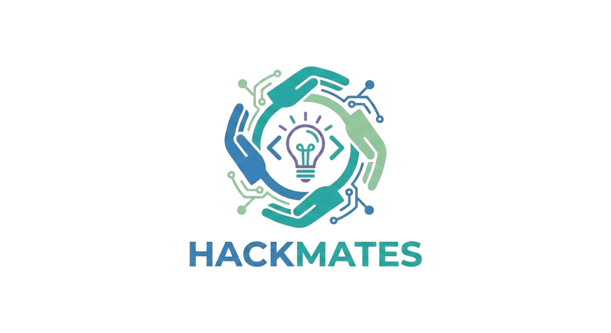

# 🚀 HackMates - India's Premier Hackathon Community Platform

<div align="center">
  
  
  **Find Your Perfect Hack Partner**
  
  [](https://hackmates.vercel.app)
  [](https://hackmates.tech)
  [](https://github.com/PAVAN2627/HackMates)
  [](LICENSE)
  
  *Developed by HackMates Developer Team*
</div>

---

## 📋 Table of Contents
- [🌟 About HackMates](#-about-hackmates)
- [✨ Key Features](#-key-features)
- [🛠️ Tech Stack](#️-tech-stack)
- [🚀 Quick Start](#-quick-start)
- [🔧 Installation](#-installation)
- [⚙️ Configuration](#️-configuration)
- [🌐 Deployment](#-deployment)
- [🤝 Contributing](#-contributing)
- [📄 License](#-license)
- [👥 Team](#-team)

---

## 🌟 About HackMates

**HackMates** is India's premier hackathon discovery and team formation platform that connects developers, designers, and innovators across the country. Whether you're looking to participate in exciting hackathons or organize your own, HackMates provides all the tools you need to build amazing solutions together.

### 🎯 Mission
To democratize innovation by connecting passionate developers, designers, and creators across India's vibrant tech ecosystem.

### 👁️ Vision
To become the go-to platform where India's next breakthrough innovations are born through meaningful collaborations and hackathon experiences.

---

## ✨ Key Features

### 🔐 **Authentication & Onboarding**
- **Email/Password Login** — Zod-validated sign-in with show/hide password toggle
- **Google OAuth** — One-click Google sign-in with mobile redirect fallback
- **Multi-step Registration** — Comprehensive onboarding: name, college, location, bio, skills (40+ options), interests, experience, availability, gender, and work style
- **Work Style Setup** — Goal (win/learn), time preference (night-owl/early-bird/flexible), commitment (full-time/part-time/casual), hours/week slider
- **Avatar Upload** — Custom photo upload with file validation (≤1MB) or gender-based default avatars
- **Account Deletion** — Full cascade delete including DMs, announcements, hackathons, teams, and Firebase Auth record

---

### 🏠 **Landing Page & Public Explore**
- **Public Landing Page** — Marketing page with live hackathon previews, features, FAQ, and calls-to-action; no login required
- **Public Hackathon Explore (`/explore`)** — Browse all live hackathons without an account; filter by mode, status, and skills
- **Connection Status Detection** — Alerts for offline or slow network connections with a 20-second timeout indicator

---

### 📊 **Dashboard**
- **Stats Overview** — Cards showing My Hackathons, Joined Hackathons, Upcoming Ads posted, and Total Users on the platform
- **My Hackathons Grid** — Quick view of hackathons you created and joined
- **My Upcoming Ads** — Manage your community hackathon advertisements inline (edit/delete)
- **Quick Actions** — Direct links to Browse Hackathons, Find Members, and Post Upcoming Ads

---

### 🏆 **Hackathon Management**
- **Create Hackathons** — Post with title, description, poster image (≤750KB), venue, date/time, mode (online/in-person/hybrid), team size (1–20), gender preference, required skills, and technology domains
- **Duplicate Detection** — Prevents duplicate hackathons by title + date + venue
- **Smart Discovery** — Search and filter hackathons by skills, mode, and status
- **Team Contract on Join** — Users must accept terms via `TeamContractDialog` before joining any hackathon
- **Status Lifecycle** — Full workflow: Open → In Progress → Completed → Reopenable
- **Creator Controls** — Edit, start, complete, reopen, or delete hackathons inline
- **Share Button** — Native Web Share API or clipboard fallback for sharing hackathon links

---

### 📋 **Hackathon Details (Tabbed Interface)**
- **Announcements Tab** — View organizer posts; organizer can create, pin, edit, and delete announcements
- **General Chat Tab** — Real-time group chat for all participants; edit/delete own messages; URLs auto-linked
- **Teams Tab** — Create/join teams, invite members (searches participants first, then all users), remove members, commit to project, view team contract, leave team (blocked if committed)
- **Members Tab** *(creator only)* — View all participants, open profiles, add to team, or remove non-team members
- **Recommended Profiles Tab** *(creator only)* — AI-suggested compatible profiles with Gemini-generated match explanations
- **Rate Teammates Button** — Appears when a hackathon or team is completed; triggers the feedback workflow

---

### 📅 **Upcoming Hackathons — Community Ads (`/upcoming`)**
- **Community-posted Ads** — Anyone can post ads for external hackathons not listed on the platform
- **Full Poster Display** — Cards show full-size images without cropping
- **Rich Filtering** — Search by name, venue/city, theme, and mode tabs
- **Detail Popup** — Full-size poster, read-more expansion, date/time/venue, contact email, and external registration link
- **Post Ad Form** — Title, description, date/time, venue, city, mode, themes (multi-select), contact email, image URL, and external link

---

### 👤 **User Profiles**
- **Comprehensive Profile** — Skills, interests, bio, college, location, social links (LinkedIn, GitHub, portfolio), experience level, and work style
- **Edit Mode** — Full in-place editing on your own profile page
- **Looking for Team Toggle** — Flag yourself as available for new hackathon opportunities
- **Avatar Upload** — Custom photo or gender-based default with preview
- **Synergy Score** — Displayed when viewing another user's profile
- **Message Button** — Opens a direct message conversation from any profile

---

### 🛡️ **Reliability & Trust System**
- **4-Tier Reliability Badges** — Newbie → Reliable → Finisher → Legend, calculated from completion rate and average ratings
- **Trust Score (0–100)** — 70% completion rate + 30% average star rating
- **Ghost Detection** — Flags users with <50% completion after 2+ projects
- **Achievement Badges** — Veteran (10+ hackathons), Never Ghosted (100% rate, 5+ projects), Highly Rated (≥4.5 avg), Perfect Record
- **Team Feedback Modal** — Rate each teammate after hackathon completion: contribution check + 1–5 star rating

---

### ⚡ **Synergy Matching Algorithm**
- **TF-IDF Cosine Similarity** — Profile token matching on skills, interests, and bio keywords
- **Complementary Skill Scoring** — Peaks at 20–50% skill overlap; avoids "too similar" and "no overlap" extremes
- **5-Factor Weighted Scoring:**
  - Goal match (25%) — win vs. learn alignment
  - Time coverage (25%) — complementary schedules score higher than identical (24-hour coverage bonus)
  - Commitment match (20%)
  - Skill complementarity (20%)
  - Hours availability (10%)
- **0–100 Synergy Score** — Shown on profile cards and sorted in the Profiles discovery page
- **Detailed Breakdown** — See exactly why you match or don't for each factor

---

### 🤖 **AI-Powered Features**
- **AI Assistant (Floating Widget)** — Powered by Gemini 2.5 Flash; context-aware with your full profile loaded into the system prompt
  - Scoped strictly to HackMates and hackathon topics
  - Quick reply chips: "How do I create a team?", "Find teammates", "Project ideas", "Report a user"
  - Rate limited to 10 calls per 60 seconds
  - Maintains last 5 messages as conversation history
- **AI Match Reasons** — Gemini generates a one-sentence explanation for each recommended profile in the Hackathon Details → Recommended Profiles tab (batch request for up to 5 candidates)

---

### 🔰 **GitHub Verification**
- **Activity Check** — Verifies your GitHub username and checks push events in the last 3 months via GitHub Events API
- **Activity Levels** — Inactive (0) / Low (1–9) / Moderate (10–29) / High (30–59) / Very High (60+ commits)
- **Trust Score Impact** — −15 (inactive) to +15 (very high activity)
- **Badges on Profile** — Inactive Developer / Active Coder / Prolific Coder
- **Auto-stale After 7 Days** — Refresh button on profile to re-verify; result saved to Firestore

---

### 👥 **Profile & Team Discovery**
- **Profiles Page (`/profiles`)** — Grid of all users excluding yourself; sorted by synergy score if work style is set
- **Advanced Filtering** — Search by name/bio, skills, interests, location, availability, and experience level
- **UserProfileModal** — Full inline profile modal without leaving the page; includes message button
- **Synergy Badge** — Visual indicator (high/medium/low) on each profile card

---

### 👨‍👩‍👧‍👦 **Teams**
- **Platform Teams** — Teams within hackathons listed on HackMates; manage members, project details, and team chat
- **Off-Platform Teams** — Create teams for hackathons not on the platform; invite members by name/skill, remove members (sends removal email to removed member), delete with confirmation
- **Team Project Details** — Leader can set project title, description, and tech stack (searchable dropdown of 40+ technologies)
- **Commit to Project** — Once a member commits, they cannot leave the team (protects the reliability score)
- **Team Chat** — Separate real-time chat per team; edit/delete own messages via right-click/long-press context menu

---

### 💬 **Direct Messages**
- **WhatsApp-style Layout** — Two-panel (conversation list + chat); list hides on mobile when a chat is open
- **Unread Count Badges** — Per-conversation unread counters in the conversation list
- **Read Receipts** — Single check (sent) and blue double-check (read) delivery indicators
- **Message Edit/Delete** — Long-press (500ms) or right-click to open context menu for own messages
- **Link Auto-detection** — URLs are automatically rendered as clickable links in all chats
- **Profile Modal from Chat** — Click an avatar in any chat to open that user's profile inline

---

### 📢 **Announcements (`/announcements`)**
- **Aggregated View** — All announcements from every hackathon you've joined in one place
- **Pinned First** — Pinned announcements always appear at the top
- **Unread Indicators** — Orange left border and "New" badge for unseen announcements
- **Mark as Read / Mark All as Read** — Per-announcement and bulk read controls
- **Author & Hackathon Context** — Shows the poster's avatar and which hackathon the announcement is from
- **Relative Timestamps** — Human-friendly time with full date on hover; URLs auto-linked in content

---

### 🔔 **Notifications**
- **In-App Notification Bell** — Real-time unread count badge in the header; notification list in a dropdown
- **Push Notifications (FCM)** — Firebase Cloud Messaging for background and foreground notifications
- **Permission Banner** — `NotificationPermissionBanner` prompts users to enable push notifications
- **FCM Token Storage** — Token saved to the user's Firestore profile for targeted delivery
- **Foreground Toast** — Notifications received while the app is open display as toast messages

---

### 📧 **Email Notifications**
- **Delivery via Google Apps Script** — No rate limits, no third-party email service costs
- **Welcome Email (Email Signup)** — Branded HTML email with account credentials
- **Welcome Email (Google Signup)** — Variant without password
- **Team Addition Email** — Sent when added to any team (platform or off-platform)
- **Team Removal Email** — Sent when removed from a team by a leader
- **Announcement Email** — Sent to all hackathon participants when a new announcement is posted
- **Admin Credentials Email** — Sent when an admin creates a new admin account

---

### 🚨 **Report User System**
- **3-Step Wizard:**
  1. Live user search (≥2 characters; searches by name, email, and skills)
  2. Reason selection from 8 categories + free-text description (≥10 characters required)
  3. Proof image upload (up to 5 files, ≤1MB each, with image preview grid)
- **Submitted to Firestore** — Reports stored in `reports` collection with status "pending"
- **Admin Review** — Reports visible and actionable in the Admin Panel

---

### 🛠️ **Admin Panel (`/admin/*`)** — Admin Role Only
- **Admin Layout** — Separate sidebar layout, fully role-gated
- **Overview Dashboard** — 6 stat cards + 4 Recharts bar charts: user growth (6 months), reports by status, hackathons by mode, active vs. blocked users; recent reports list
- **User Management** — List all users, search/filter, block/unblock (cascade deletes user content), "Add Admin" dialog (creates Firebase Auth user + Firestore doc via secondary app instance, sends credentials email)
- **Report Management** — Filter reports by status, expand for description + proof images, mark as reviewed/resolved, block the reported user directly
- **Hackathon Management** — Tabs for Platform Hackathons and Upcoming Hackathons; delete platform hackathons; edit/delete upcoming hackathon ads via inline dialog

---

### 🎨 **UI & UX**
- **Theme System** — Light / Dark / System via `ThemeContext` with persistent toggle in the header
- **Responsive Layout** — `DashboardLayout` with collapsible sidebar on desktop + bottom navigation bar on mobile
- **Error Boundary** — Catches and displays React errors gracefully throughout the app
- **Confirm Dialogs** — Custom `ConfirmDialog` component replaces native `window.confirm()` everywhere
- **Relative Timestamps** — `RelativeTime` component with full date tooltip on hover
- **Text Formatter** — Preserves line breaks and smart formatting in descriptions
- **Link Detector** — Auto-renders URLs as clickable `<a>` tags in messages and announcements
- **Message Context Menu** — Right-click or long-press (500ms) for edit/delete on own messages
- **TypewriterText** — Animated headline text on the landing page
- **Loading States** — Consistent skeleton and spinner components throughout

---

## 🛠️ Tech Stack

### **Frontend**
- **React 18** — Modern React with hooks and concurrent features
- **TypeScript** — Type-safe development with excellent IDE support
- **Vite** — Lightning-fast build tool and development server
- **Tailwind CSS** — Utility-first CSS framework for rapid styling

### **UI Components**
- **Radix UI** — Accessible, unstyled UI primitives
- **shadcn/ui** — Beautiful, customizable component library
- **Lucide React** — Consistent and customizable icon library
- **Recharts** — Composable charting library (used in Admin analytics)
- **Sonner** — Beautiful toast notifications

### **Backend & Database**
- **Firebase Firestore** — NoSQL real-time database (8+ collections)
- **Firebase Authentication** — Secure email/password + Google OAuth
- **Firebase Storage** — Cloud storage for images and files
- **Firebase Cloud Messaging (FCM)** — Push notifications (web + background via service worker)
- **Real-time Listeners** — Live data synchronization across all features

### **AI & External Services**
- **Google Gemini 2.5 Flash** — AI Assistant + AI Match Reason generation
- **GitHub Events API** — GitHub activity verification
- **Google Apps Script** — Email notification delivery (unlimited, free)

### **State Management**
- **React Context** — Authentication and theme management
- **Custom Hooks** — Reusable logic for all data fetching and business logic
- **Firebase SDK** — Direct integration with Firebase services

### **Development Tools**
- **ESLint** — Code linting and quality assurance
- **PostCSS** — CSS processing and optimization
- **TypeScript Config** — Strict type checking

---

## 🚀 Quick Start

### Prerequisites
- **Node.js** (v18 or higher)
- **npm** or **yarn** package manager
- **Firebase Account** for backend services
- **Google Gemini API Key** (optional, for AI features)

### 1. Clone the Repository
```bash
git clone https://github.com/PAVAN2627/HackMates.git
cd HackMates
```

### 2. Install Dependencies
```bash
npm install
# or
yarn install
```

### 3. Environment Setup
Create a `.env` file in the root directory:
```env
# Firebase Configuration
VITE_FIREBASE_API_KEY=your_firebase_api_key
VITE_FIREBASE_AUTH_DOMAIN=your_firebase_auth_domain
VITE_FIREBASE_PROJECT_ID=your_firebase_project_id
VITE_FIREBASE_STORAGE_BUCKET=your_firebase_storage_bucket
VITE_FIREBASE_MESSAGING_SENDER_ID=your_firebase_sender_id
VITE_FIREBASE_APP_ID=your_firebase_app_id
VITE_FIREBASE_VAPID_KEY=your_firebase_vapid_key

# Google Gemini AI (for AI Assistant + AI Match Reasons)
VITE_GEMINI_API_KEY=your_gemini_api_key

# Google Apps Script Email Service
VITE_GOOGLE_SCRIPT_URL=your_google_apps_script_deployment_url
```

### 4. Start Development Server
```bash
npm run dev
# or
yarn dev
```

Visit `http://localhost:5173` to see the application. 🎉

---

## 🔧 Installation

### Development Setup

1. **Clone and Install**
   ```bash
   git clone https://github.com/PAVAN2627/HackMates.git
   cd HackMates
   npm install
   ```

2. **Firebase Setup**
   - Create a new Firebase project at [Firebase Console](https://console.firebase.google.com)
   - Enable Authentication (Email/Password + Google)
   - Create Firestore Database
   - Enable Storage
   - Enable Cloud Messaging (for push notifications)
   - Copy configuration to `.env` file

3. **Database Collections**
   The following Firestore collections are created automatically:
   - `users` — User profiles, work style, GitHub verification, FCM tokens
   - `hackathons` — Hackathon events and details
   - `hackathonChat` — Real-time group chat messages
   - `teamChats` — Team-specific conversations
   - `directMessages` — Private one-on-one conversations
   - `announcements` — Event announcements (with pinning support)
   - `teamFeedback` — Post-hackathon ratings and reviews
   - `reports` — User-submitted abuse reports
   - `upcomingHackathons` — Community-posted external hackathon ads
   - `notifications` — In-app notification records

4. **Firestore Indexes**
   Create these composite indexes in Firebase Console → Firestore → Indexes:

   **teamChats Index:**
   - Collection: `teamChats`
   - Fields: `hackathonId` (Ascending), `teamId` (Ascending), `createdAt` (Ascending)

   **announcements Index:**
   - Collection: `announcements`
   - Fields: `hackathonId` (Ascending), `createdAt` (Descending)

   **directMessages Index:**
   - Collection: `directMessages`
   - Fields: `participants` (Array), `createdAt` (Descending)

5. **Email Service Setup (Optional)**
   To enable email notifications:
   - Create a Google Apps Script project
   - Deploy as Web App with "Anyone" access
   - Add the deployment URL to `VITE_GOOGLE_SCRIPT_URL` in `.env`

6. **Push Notifications Setup (Optional)**
   - Enable Firebase Cloud Messaging in your Firebase project
   - Generate a VAPID key in Project Settings → Cloud Messaging
   - Add the key to `VITE_FIREBASE_VAPID_KEY` in `.env`
   - The service worker (`public/firebase-messaging-sw.js`) handles background messages automatically

---

## ⚙️ Configuration

### Firebase Security Rules

The project uses granular Firestore security rules. See `firestore.rules` in the root for the full ruleset. Key access patterns:

- **Users** — Public read; own-document write only
- **Hackathons** — Public read; authenticated create; creator/member write
- **Direct Messages** — Private to sender and recipient
- **Reports** — Write by authenticated users; admin read/write
- **Upcoming Hackathons** — Public read; authenticated create; creator/admin write

**Storage Rules:**
```javascript
rules_version = '2';
service firebase.storage {
  match /b/{bucket}/o {
    match /user-avatars/{userId}/{allPaths=**} {
      allow read: if true;
      allow write: if request.auth != null && request.auth.uid == userId;
    }
    match /hackathon-images/{allPaths=**} {
      allow read: if true;
      allow write: if request.auth != null;
    }
  }
}
```

---

## 🌐 Deployment

### Deploy to Vercel (Recommended)

1. **Connect Repository**
   - Fork this repository to your GitHub account
   - Connect your GitHub account to [Vercel](https://vercel.com)
   - Import the HackMates repository

2. **Environment Variables**
   Add these in the Vercel dashboard:
   ```
   VITE_FIREBASE_API_KEY
   VITE_FIREBASE_AUTH_DOMAIN
   VITE_FIREBASE_PROJECT_ID
   VITE_FIREBASE_STORAGE_BUCKET
   VITE_FIREBASE_MESSAGING_SENDER_ID
   VITE_FIREBASE_APP_ID
   VITE_FIREBASE_VAPID_KEY
   VITE_GEMINI_API_KEY
   VITE_GOOGLE_SCRIPT_URL
   ```

3. **Deploy**
   Vercel will automatically build and deploy. Your app will be live at `https://your-app-name.vercel.app`.

### Alternative Options

**Netlify:**
```bash
npm run build
# Upload dist/ folder to Netlify
```

**Firebase Hosting:**
```bash
npm install -g firebase-tools
firebase login
firebase init hosting
npm run build
firebase deploy
```

---

## 🤝 Contributing

We welcome contributions from the community!

### 🐛 Bug Reports
- Use the [GitHub Issues](https://github.com/PAVAN2627/HackMates/issues) page
- Include detailed reproduction steps and screenshots if applicable

### 💡 Feature Requests
- Open an issue with the "enhancement" label
- Describe the feature and its benefits

### 🔧 Pull Requests
1. Fork the repository
2. Create a feature branch: `git checkout -b feature/amazing-feature`
3. Commit changes: `git commit -m 'Add amazing feature'`
4. Push to branch: `git push origin feature/amazing-feature`
5. Open a Pull Request

### 📝 Development Guidelines
- Follow TypeScript best practices
- Write meaningful commit messages
- Add comments for complex logic
- Test your changes thoroughly
- Update documentation as needed

---

## 📄 License

This project is licensed under the **MIT License** — see the [LICENSE](LICENSE) file for details.

---

## 👥 Team

<div align="center">

### HackMates Developer Team

**Lead Developer & Project Architect**  
[PAVAN MALI](https://github.com/PAVAN2627)

*Passionate about building innovative solutions that connect developers and foster collaboration in India's vibrant tech community.*

---

### 🌐 Official Website

Visit [hackmates.tech](https://hackmates.tech) for more information about our platform, team, and latest updates.

---

### 🌟 Connect With Us

[](https://github.com/PAVAN2627/HackMates)
[](https://hackmates.tech)
[](https://linkedin.com/company/hackmatestech)

</div>

---

## 🚀 What's Next?

### Upcoming Features
- **Video Integration** — Built-in video calls for team meetings
- **Project Showcase** — Portfolio section for completed hackathon projects
- **Leaderboards** — Gamification with points and achievements
- **Mobile App** — Native iOS and Android applications
- **Public API** — Open API for third-party integrations
- **Mentor Matching** — Connect with experienced mentors
- **Advanced AI** — Team composition analysis and project success prediction

### Community Goals
- **10,000+ Registered Developers** by end of 2025
- **500+ Successful Hackathons** hosted on the platform
- **Pan-India Presence** across all major tech cities
- **University Partnerships** with top engineering colleges

---

<div align="center">

### 🎉 Ready to Start Your Hackathon Journey?

**[Join HackMates Today](https://hackmates.vercel.app) and connect with India's most talented developers!**

---

*Made with ❤️ for the Indian developer community*

**HackMates** — *Where Innovation Meets Collaboration*

</div>
