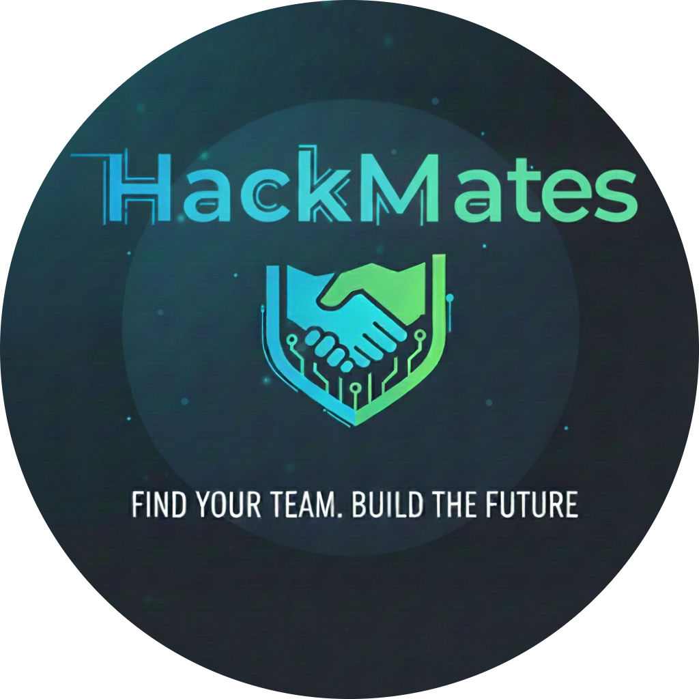

# 🚀 HackMates - India's Premier Hackathon Community Platform

<div align="center">
  
  
  **Find Your Perfect Hack Partner**
  
  [](https://hackmates.vercel.app)
  [](https://github.com/PAVAN2627/HackMates)
  [](LICENSE)
  
  *Built with ❤️ by NoobcodersIND*
</div>

---

## 📋 Table of Contents
- [🌟 About HackMates](#-about-hackmates)
- [✨ Key Features](#-key-features)
- [🛠️ Tech Stack](#️-tech-stack)
- [🚀 Quick Start](#-quick-start)
- [📱 Screenshots](#-screenshots)
- [🔧 Installation](#-installation)
- [⚙️ Configuration](#️-configuration)
- [🌐 Deployment](#-deployment)
- [🤝 Contributing](#-contributing)
- [📄 License](#-license)
- [👥 Team](#-team)

---

## 🌟 About HackMates

**HackMates** is India's premier hackathon discovery and team formation platform that connects developers, designers, and innovators across the country. Whether you're looking to participate in exciting hackathons or organize your own, HackMates provides all the tools you need to build amazing solutions together.

### 🎯 Mission
To democratize innovation by connecting passionate developers, designers, and creators across India's vibrant tech ecosystem.

### � HVision  
To become the go-to platform where India's next breakthrough innovations are born through meaningful collaborations and hackathon experiences.

---

## ✨ Key Features

### 🏆 **Hackathon Management**
- **Post Hackathons**: Any user can create and organize hackathons
- **Smart Discovery**: Find hackathons by skills, location, and mode
- **Team Formation**: Easy join/leave functionality with real-time updates
- **Status Management**: Open/closed hackathon states with proper restrictions

### 👥 **Profile & Team Discovery**
- **Comprehensive Profiles**: Showcase skills, experience, and projects
- **Smart Matching**: Find teammates by complementary skills
- **Advanced Filtering**: Search by location, availability, and expertise
- **Social Integration**: LinkedIn, GitHub, and portfolio links

### 💬 **Real-time Communication**
- **Direct Messaging**: One-on-one conversations with team members
- **Hackathon Chat**: Event-specific group discussions
- **Live Updates**: Real-time message delivery and notifications
- **Rich Content**: Support for links and media sharing

### 🎨 **Modern User Experience**
- **Responsive Design**: Optimized for all devices and screen sizes
- **Theme Support**: Light, dark, and system theme modes
- **Mobile Navigation**: Touch-friendly interface with bottom navigation
- **Performance Optimized**: Fast loading with efficient caching

### 🔔 **Smart Notifications**
- **Real-time Alerts**: Instant notifications for messages and announcements
- **Unread Tracking**: Visual indicators for new content
- **Hackathon Updates**: Stay informed about event changes
- **Announcement System**: Important updates from organizers

---

## 🛠️ Tech Stack

### **Frontend**
- **React 18** - Modern React with hooks and concurrent features
- **TypeScript** - Type-safe development with excellent IDE support
- **Vite** - Lightning-fast build tool and development server
- **Tailwind CSS** - Utility-first CSS framework for rapid styling

### **UI Components**
- **Radix UI** - Accessible, unstyled UI primitives
- **shadcn/ui** - Beautiful, customizable component library
- **Lucide React** - Consistent and customizable icon library
- **Sonner** - Beautiful toast notifications

### **Backend & Database**
- **Firebase Firestore** - NoSQL database with real-time capabilities
- **Firebase Authentication** - Secure user authentication system
- **Firebase Storage** - Cloud storage for images and files
- **Real-time Listeners** - Live data synchronization

### **State Management**
- **React Context** - Authentication and theme management
- **Custom Hooks** - Reusable logic for data fetching and business logic
- **Firebase SDK** - Direct integration with Firebase services

### **Development Tools**
- **ESLint** - Code linting and quality assurance
- **PostCSS** - CSS processing and optimization
- **TypeScript Config** - Strict type checking configuration

---

## 🚀 Quick Start

### Prerequisites
- **Node.js** (v18 or higher)
- **npm** or **yarn** package manager
- **Firebase Account** for backend services

### 1. Clone the Repository
```bash
git clone https://github.com/PAVAN2627/HackMates.git
cd HackMates
```

### 2. Install Dependencies
```bash
npm install
# or
yarn install
```

### 3. Environment Setup
Create a `.env` file in the root directory:
```env
# Firebase Configuration
VITE_FIREBASE_API_KEY=your_firebase_api_key
VITE_FIREBASE_AUTH_DOMAIN=your_firebase_auth_domain
VITE_FIREBASE_PROJECT_ID=your_firebase_project_id
VITE_FIREBASE_STORAGE_BUCKET=your_firebase_storage_bucket
VITE_FIREBASE_MESSAGING_SENDER_ID=your_firebase_sender_id
VITE_FIREBASE_APP_ID=your_firebase_app_id
```

### 4. Start Development Server
```bash
npm run dev
# or
yarn dev
```

Visit `http://localhost:5173` to see the application running! 🎉

---

## 📱 Screenshots

<div align="center">
  
  
  
  
  
</div>

---

## 🔧 Installation

### Development Setup

1. **Clone and Install**
   ```bash
   git clone https://github.com/PAVAN2627/HackMates.git
   cd HackMates
   npm install
   ```

2. **Firebase Setup**
   - Create a new Firebase project at [Firebase Console](https://console.firebase.google.com)
   - Enable Authentication (Email/Password)
   - Create Firestore Database
   - Enable Storage
   - Copy configuration to `.env` file

3. **Database Collections**
   The following Firestore collections will be created automatically:
   - `users` - User profiles and information
   - `hackathons` - Hackathon events and details
   - `hackathonChat` - Real-time chat messages
   - `directMessages` - Private conversations
   - `announcements` - Event announcements

4. **Storage Buckets**
   Configure Firebase Storage rules for:
   - `hackathon-images` - Event posters and media
   - `user-avatars` - Profile pictures

---

## ⚙️ Configuration

### Firebase Security Rules

**Firestore Rules:**
```javascript
rules_version = '2';
service cloud.firestore {
  match /databases/{database}/documents {
    // Users can read all profiles but only edit their own
    match /users/{userId} {
      allow read: if true;
      allow write: if request.auth != null && request.auth.uid == userId;
    }
    
    // Hackathons are readable by all, writable by authenticated users
    match /hackathons/{hackathonId} {
      allow read: if true;
      allow create: if request.auth != null;
      allow update: if request.auth != null && 
        (request.auth.uid == resource.data.creatorId || 
         request.auth.uid in resource.data.teamMembers);
    }
    
    // Messages are private between sender and recipient
    match /directMessages/{messageId} {
      allow read, write: if request.auth != null && 
        (request.auth.uid == resource.data.senderId || 
         request.auth.uid == resource.data.recipientId);
    }
  }
}
```

**Storage Rules:**
```javascript
rules_version = '2';
service firebase.storage {
  match /b/{bucket}/o {
    match /user-avatars/{userId}/{allPaths=**} {
      allow read: if true;
      allow write: if request.auth != null && request.auth.uid == userId;
    }
    
    match /hackathon-images/{allPaths=**} {
      allow read: if true;
      allow write: if request.auth != null;
    }
  }
}
```

---

## 🌐 Deployment

### Deploy to Vercel (Recommended)

1. **Connect Repository**
   - Fork this repository to your GitHub account
   - Connect your GitHub account to [Vercel](https://vercel.com)
   - Import the HackMates repository

2. **Environment Variables**
   Add the following environment variables in Vercel dashboard:
   ```
   VITE_FIREBASE_API_KEY
   VITE_FIREBASE_AUTH_DOMAIN
   VITE_FIREBASE_PROJECT_ID
   VITE_FIREBASE_STORAGE_BUCKET
   VITE_FIREBASE_MESSAGING_SENDER_ID
   VITE_FIREBASE_APP_ID
   ```

3. **Deploy**
   - Vercel will automatically build and deploy your application
   - Your app will be available at `https://your-app-name.vercel.app`

### Alternative Deployment Options

**Netlify:**
```bash
npm run build
# Upload dist folder to Netlify
```

**Firebase Hosting:**
```bash
npm install -g firebase-tools
firebase login
firebase init hosting
npm run build
firebase deploy
```

---

## 🤝 Contributing

We welcome contributions from the community! Here's how you can help:

### 🐛 Bug Reports
- Use the [GitHub Issues](https://github.com/PAVAN2627/HackMates/issues) page
- Provide detailed reproduction steps
- Include screenshots if applicable

### 💡 Feature Requests
- Open an issue with the "enhancement" label
- Describe the feature and its benefits
- Discuss implementation approaches

### 🔧 Pull Requests
1. Fork the repository
2. Create a feature branch: `git checkout -b feature/amazing-feature`
3. Commit changes: `git commit -m 'Add amazing feature'`
4. Push to branch: `git push origin feature/amazing-feature`
5. Open a Pull Request

### 📝 Development Guidelines
- Follow TypeScript best practices
- Write meaningful commit messages
- Add comments for complex logic
- Test your changes thoroughly
- Update documentation as needed

---

## 📄 License

This project is licensed under the **MIT License** - see the [LICENSE](LICENSE) file for details.

```
MIT License

Copyright (c) 2025 NoobcodersIND

Permission is hereby granted, free of charge, to any person obtaining a copy
of this software and associated documentation files (the "Software"), to deal
in the Software without restriction, including without limitation the rights
to use, copy, modify, merge, publish, distribute, sublicense, and/or sell
copies of the Software, and to permit persons to whom the Software is
furnished to do so, subject to the following conditions:

The above copyright notice and this permission notice shall be included in all
copies or substantial portions of the Software.
```

---

## 👥 Team

<div align="center">

### NoobcodersIND Development Team

**Lead Developer & Project Architect**  
[PAVAN MALI](https://github.com/PAVAN2627)

*Passionate about building innovative solutions that connect developers and foster collaboration in the tech community.*

---

### 🌟 Connect With Us

[](https://github.com/PAVAN2627)
[](https://linkedin.com/in/your-profile)
[](https://twitter.com/your-handle)

</div>

---

## 🚀 What's Next?

### Upcoming Features
- **AI-Powered Matching** - Smart team recommendations based on skills and project history
- **Video Integration** - Built-in video calls for team meetings
- **Project Showcase** - Portfolio section for completed hackathon projects
- **Leaderboards** - Gamification with points and achievements
- **Mobile App** - Native iOS and Android applications
- **API Access** - Public API for third-party integrations

### Community Goals
- **10,000+ Registered Developers** by end of 2025
- **500+ Successful Hackathons** hosted on the platform
- **Pan-India Presence** across all major tech cities
- **University Partnerships** with top engineering colleges

---

<div align="center">

### 🎉 Ready to Start Your Hackathon Journey?

**[Join HackMates Today](https://hackmates.vercel.app) and connect with India's most talented developers!**

---

*Made with ❤️ for the Indian developer community*

**HackMates** - *Where Innovation Meets Collaboration*

</div>